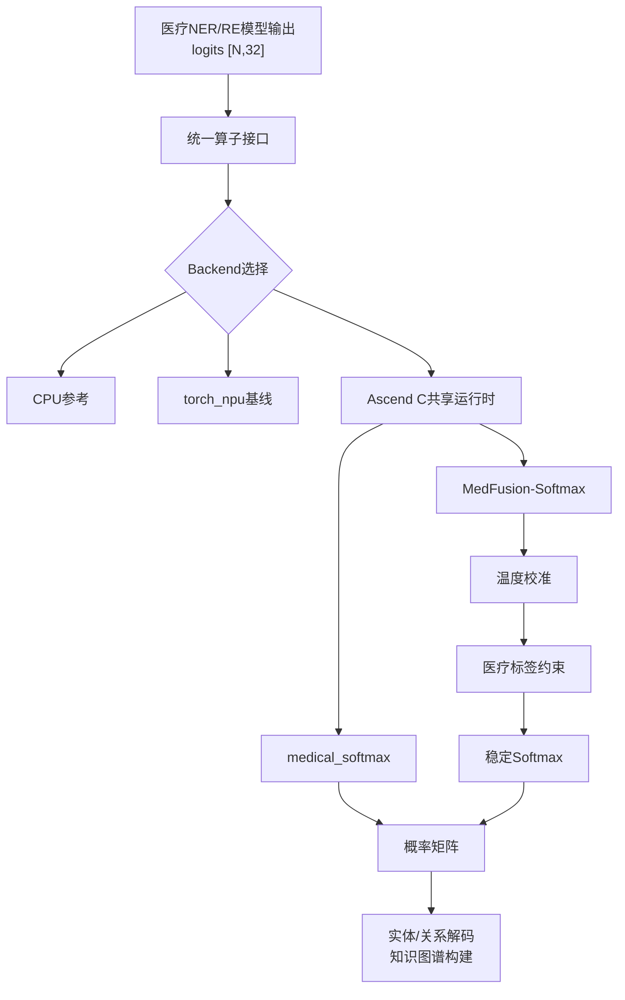

# ModelEngine 开源项目贡献赛 NPU 优化技术报告

## MedFusion-Softmax：面向医疗知识抽取的校准—约束—归一化融合算子

| 项目       | 内容                                             |
| ---------- | ------------------------------------------------ |
| 赛事       | ModelEngine 开源项目贡献赛 2026                  |
| 对应任务   | 任务二：基于知识图谱的问答智能体实现             |
| 对应评分项 | NPU 算子优化实现（加分项 10 分）                 |
| 硬件       | Ascend 910B3，64 GB HBM                          |
| 软件       | CANN 8.3.RC1、PyTorch 2.7.1、`torch_npu` 2.7.1 |

---

## 摘要

医疗知识图谱生成需要对大规模候选实体、关系和三元组进行打分、约束与归一化。通用实现通常由温度校准、标签 Mask 和 Softmax 多个框架算子串联完成，会产生额外的 Kernel Launch 和中间张量访问；在高并发、大批量知识抽取场景中，这类规则形状后处理会成为可量化的延迟与能效开销。

本项目围绕 `[N,32]` 医疗标签打分矩阵，设计并实现了两级 Ascend C 算子：

1. 全向量化、数值稳定的行级 Softmax；
2. 将温度校准、医疗标签约束 Mask 与稳定 Softmax 合并为单个 Kernel 的 **MedFusion-Softmax**。

实现采用 40 个 Vector Core 行并行、248 行多行 Tiling、`WholeReduceMax/Sum` 归约、`Brcb` 广播、UB 数据复用及 Mask 零步长广播，并通过共享 C ABI 运行时接入 Python。运行时同时支持 Host 数据路径和 `torch_npu` Device Pointer 异步路径，从而既能进行真实端到端测试，也能进行不含数据搬运的公平 device-resident 对比。

在 Ascend 910B3 上，纯 Ascend C Softmax 达到 **3.412 B rows/s**，相对 `torch_npu` 提升 **2.71×**，P50/P99 分别降低 **53.0%/50.3%**。融合算子达到 **3.156 B rows/s**，相对公平的 `torch_npu` 三算子组合提升 **3.12×**，P50/P99 加速 **2.21×/2.13×**。融合能效按整卡功耗提升 **3.00×**，扣除空闲功耗后提升 **2.70×**。

msProf 表明，融合后每核 Vector FOPS 增加 **29.3%**，Task Duration 仅增加 **7.59%**；每核 GM 读取仅由 625.000 KB 增至 625.125 KB，GM 写入保持 625.000 KB，证明新增语义主要在 UB 内完成，没有形成大规模中间 GM 流量。所有正确性、五轮重复、端到端、能效、Profiler 和环境信息均由 `NPU_source/run_all.sh full` 一键生成并自动验收。

**关键词：** 医疗知识图谱、实体识别、关系抽取、Ascend C、算子融合、NPU、Softmax、能效优化

---

## 1. 赛题契合度

赛题任务二要求围绕医疗数据构建知识图谱生成与问答智能体，设计实体识别、关系抽取、三元组生成与校验等核心算子；NPU 加分项要求：

- 场景适合 NPU；
- 有 CPU/NPU 对比分析；
- 优化思路清晰；
- 提供吞吐、延迟以及能效或资源利用率；
- 工程可复用、可复现。

本项目对应医疗实体识别和关系抽取的打分后处理阶段。设候选数量为 `N`，医疗标签数量为 `C=32`，模型输出为：

```text
logits: FP32 [N, 32]
```

每个候选需要经过概率归一化，并根据上层医疗本体规则屏蔽不合法类型。例如：

- 症状实体不应被归一化到药物专属标签；
- 某些关系标签只允许特定头实体/尾实体类型组合；
- 置信度需要通过温度参数校准，降低过度自信。

因此，本项目不是把一个脱离业务的数学算子简单搬到 NPU，而是把医疗知识抽取后处理中的真实语义链条映射为 NPU 融合 Kernel。

---

## 2. 问题定义

### 2.1 纯 Softmax

对第 `r` 行：

$$
m_r = \max_c x_{r,c}
$$

$$
p_{r,c} =
\frac{\exp(x_{r,c}-m_r)}
{\sum_j\exp(x_{r,j}-m_r)}
$$

先减最大值保证指数计算稳定。

### 2.2 医疗约束融合

MedFusion-Softmax 定义为：

$$
z_{r,c} = x_{r,c}/T + M_c
$$

$$
p_{r,c} = \operatorname{Softmax}(z_{r,c})
$$

其中：

- `T>0` 为温度参数；
- 合法标签 `M_c=0`；
- 非法标签 `M_c=-10000`。

由于 Softmax 在减最大值后计算，非法标签对应的指数项下溢为 0，从而得到严格为 0 的输出概率。

### 2.3 通用组合执行的开销

`torch_npu` 公平基线为：

```python
torch.softmax(
    logits * inverse_temperature + additive_mask,
    dim=-1,
)
```

Eager 模式下，它表达了三个独立运算：

```text
Muls → Add → Softmax
```

其主要成本包括：

- 多次 Host/Framework 调度；
- 多个 Kernel Launch；
- 中间张量的生命周期管理；
- 中间结果潜在的 GM 写回和再次读取。

本项目将三步合为一个 Ascend C Kernel。

---

## 3. 总体方案



方案分为四层：

1. **Kernel 层**：两个 Ascend C Vector Kernel；
2. **Runtime 层**：AscendCL Stream、设备内存、Host/Device C ABI；
3. **Integration 层**：Python `ctypes` 与后端选择；
4. **Evidence 层**：五轮性能、端到端、能效、msProf、自动验收与打包。

---

## 4. 核心创新

### 4.1 创新一：面向医疗本体约束的语义融合

Softmax 本身是成熟算子，本项目的主要业务创新是：

> 将“置信度校准—医疗标签合法性约束—概率归一化”三段后处理重构为单个 NPU Kernel。

这一设计兼具业务价值和体系结构价值：

- 业务上，Mask 可承载实体类型、关系方向和本体合法性约束；
- 模型上，温度参数可校准置信度；
- 工程上，上层只调用一个算子；
- 性能上，减少 Kernel Launch 和中间数据路径。

该创新适合医疗知识图谱场景，因为医疗抽取往往具有明确标签集合和规则约束，约束不是通用 Softmax 的附属参数，而是知识图谱质量控制的一部分。

### 4.2 创新二：面向固定标签空间的多行全向量化

最终 Kernel 使用：

```text
blockDim = 40
TILE_ROWS = 248
labels = 32
dtype = FP32
```

每个 Core 获取连续行区间；每次将最多 248 行搬入 UB。248 同时满足：

- 小于 8 位 Repeat 次数上限；
- 可被 8 整除，适配 `Brcb` 每次处理 8 个标量；
- 输入、输出、归约与广播 Buffer 可容纳于 UB；
- 一次处理多行，减少逐行调度和小粒度数据搬运。

纯 Softmax 主路径：

```text
WholeReduceMax
→ Brcb
→ Sub
→ Exp
→ WholeReduceSum
→ Brcb
→ Div
```

没有逐标签标量循环参与主计算，行最大值和行和均由 Vector Reduction 完成。

### 4.3 创新三：Mask 每核一次加载、跨行零步长广播

融合核把 `[32]` Mask 在每个 Core 中加载一次：

```cpp
DataCopy(maskLocal, maskGm, labels);
```

随后通过：

```cpp
BinaryRepeatParams maskBroadcast = {
    1, 1, 1,
    rowBlocks, 0, rowBlocks
};
```

令 Mask 的 Repeat Stride 为 0，使同一份 32 标签约束在 248 行之间复用。这样，Label Mask 不会随 `N` 线性增加 GM 读流量。

### 4.4 创新四：UB 生命周期重构

在融合流程中：

1. `yLocal` 保存温度校准和 Mask 后的分数；
2. 求得行最大值后，原始 `xLocal` 已无语义需求；
3. 将 `xLocal` 复用为 `Sub + Exp` 的临时空间；
4. 归约行和后写入 `yLocal` 作为最终概率。

该设计避免为融合额外申请一个 `[248,32]` 级别的 LocalTensor。

### 4.5 创新五：Host/Device 双路径共享运行时

共享库暴露：

- `medical_npu_run_f32`：Host 输入、内部 H2D/Kernel/D2H；
- `medical_npu_fused_run_f32`：融合 Host 输入路径；
- `medical_npu_fused_run_device_async_f32`：直接接收 NPU Tensor 地址；
- `medical_npu_fused_synchronize`：显式同步。

运行时采用：

- 持久 ACL Stream；
- 按容量增长的持久设备 Buffer；
- C ABI，避免 Python/C++ ABI 绑定；
- `ctypes` 轻量接入；
- Mutex 保护共享状态；
- 不调用会破坏同进程 `torch_npu` 的全局 Finalize/Reset。

Device Pointer 路径使融合对比能够排除 H2D/D2H，将 Kernel 与框架组合放在同一 device-resident 口径下。

### 4.6 创新六：把“跑得快”升级为可审计证据链

一键脚本不仅执行 benchmark，还自动生成：

- 5 轮原始 JSON；
- CV、P50、P99；
- pageable H2D + Kernel + D2H 端到端结果；
- 整卡与扣空闲功耗两种能效；
- 纯核和融合核 msProf 原始目录；
- 环境、设备状态、日志和源码 SHA256；
- 自动 `Validation PASS/FAIL`；
- 源码包、结果包及 `SHA256SUMS`。

这解决了算子比赛中常见的三类可信度问题：只报最好一轮、混淆计时口径、缺少原始证据。

---

## 5. 实现细节

### 5.1 Core 间行切分

每个 Core 处理：

$$
\text{rowsPerCore} =
\left\lceil \frac{N}{\text{coreNum}} \right\rceil
$$

并处理连续的 GM 区间，尾 Core 自动裁剪。

### 5.2 UB 组织

纯核包括：

- 双 Buffer `inQueue`；
- 双 Buffer `outQueue`；
- 每行一个标量的 `reduceBuf`；
- 每行一个 32 字节块的 `broadcastBuf`。

融合核额外加入只存 32 个 FP32 值的 `maskQueue`，其余大 Buffer 规模基本不变。

### 5.3 数值稳定

所有 Softmax 均先执行：

```text
x - row_max
```

再执行 `Exp`，避免大正数导致指数上溢。

### 5.4 构建和直调

Ascend C Kernel 编译为静态库，并链接：

- `medical_softmax_run`；
- `medical_fused_softmax_run`；
- `libmedical_npu_runtime.so`。

测试程序使用 AscendCL 直接分配设备内存、创建 Stream、启动 Kernel 和同步，不依赖自定义 OPP 安装。

### 5.5 可插拔 Python 接口

`NpuSoftmaxOperator` 的自动后端优先级为：

```text
Ascend C → torch_npu → CPU
```

上层调用统一输入：

```python
{"scores": scores}
```

这使 NPU 优化可作为医疗知识抽取算子的可选后端，而不要求上层 Agent 感知底层 KernelLaunch 细节。

---

## 6. 优化过程

本项目采用逐层定位、逐层消除开销的方式，而非一次性“猜参数”：

1. **正确性基线**：实现 CPU 稳定 Softmax 和 Ascend C 行级版本；
2. **多核切分**：从少量 Core 扩展到 40 个 Vector Core；
3. **多行 Tiling**：将逐行粒度提升为每 Tile 最多 248 行；
4. **全向量化归约**：以 `WholeReduceMax/Sum + Brcb` 替换细粒度处理；
5. **公平计时**：分离持续吞吐、单请求延迟和端到端延迟；
6. **运行时集成**：增加持久 Buffer、共享库和 Python 接口；
7. **业务融合**：加入温度校准和医疗 Label Mask；
8. **Device Pointer 路径**：排除数据搬运后与 `torch_npu` 组合公平比较；
9. **能效和 Profiler**：验证速度来自有效计算而不是错误计时；
10. **一键复现**：固定正式配置，保留所有原始数据。

最终参数不是单次试跑的偶然值，而是由正确性、性能、稳定性和 Profiler 共同约束的工程选择。

---

## 7. 实验设计

### 7.1 环境

| 项目          | 配置                      |
| ------------- | ------------------------- |
| NPU           | Ascend 910B3              |
| HBM           | 64 GB                     |
| CANN          | 8.3.RC1                   |
| OS            | EulerOS 系 Linux，aarch64 |
| Python        | 3.11.10                   |
| PyTorch       | 2.7.1                     |
| `torch_npu` | 2.7.1                     |
| NumPy         | 1.26.4                    |
| CMake         | 3.16.5                    |
| GCC           | 7.3.0                     |

实验前 `npu-smi` 显示：

- NPU Health：OK；
- 无其他 NPU 进程；
- 空闲功耗约 98 W。

### 7.2 工作负载

| 参数     |      值 |
| -------- | ------: |
| Rows     | 200,000 |
| Labels   |      32 |
| 数据类型 |    FP32 |
| 吞吐迭代 |     200 |
| 延迟迭代 |     200 |
| 重复轮数 |       5 |
| BlockDim |      40 |
| 融合温度 |    1.35 |

每次纯输入包含：

$$
200000 \times 32 = 6.4\text{ M FP32 elements}
$$

即约 25.6 MB 输入和 25.6 MB 输出。

### 7.3 基线

#### CPU

PyTorch CPU FP32 行级 Softmax。

#### NPU 通用基线

```python
torch.softmax(x, dim=-1)
```

#### 融合公平基线

```python
torch.softmax(
    x * inverse_temperature + mask,
    dim=-1,
)
```

融合基线已经使用乘逆温度，而不是更慢的逐元素除法，避免故意弱化对手。

### 7.4 指标口径

| 指标                 | 口径                                    |
| -------------------- | --------------------------------------- |
| Sustained throughput | 多次异步提交，最后统一同步              |
| P50/P99              | 每次 Launch 后同步                      |
| Device-resident      | 输入、Mask、输出均在 NPU                |
| End-to-end           | pageable H2D + Kernel + D2H，分配不计时 |
| Gross rows/J         | 吞吐 / 负载平均整卡功耗                 |
| Dynamic rows/J       | 吞吐 /（负载功耗 − 空闲功耗）          |
| Profiler Task        | `OpBasicInfo.csv` 的 Task Duration    |

Profiler 插桩会放大 Host 程序耗时，因此报告只引用设备侧 Task Duration，不引用插桩状态下的应用吞吐。

### 7.5 统计方法

- 纯 Softmax、融合算子、端到端均执行 5 轮；
- 报告轮间中位数；
- 吞吐稳定性使用变异系数 CV；
- 能效在 20 秒持续负载期间采样；
- 保留每轮 JSON 和完整日志；
- 自动阈值校验失败时返回非 0 退出码。

---

## 8. 实验结果

### 8.1 纯 Softmax 性能

| 系统               |    吞吐（rows/s） |     CV |                P50 |                P99 |
| ------------------ | ----------------: | -----: | -----------------: | -----------------: |
| CPU / PyTorch      |          26.864 M | 30.08% |           2.971 ms |          60.021 ms |
| NPU /`torch_npu` |           1.258 B |  0.19% |           0.213 ms |           0.236 ms |
| NPU / Ascend C     | **3.412 B** |  2.26% | **0.100 ms** | **0.117 ms** |

相对 `torch_npu`：

- 吞吐：**2.71×**；
- P50：降低 **53.0%**；
- P99：降低 **50.3%**。

Ascend C 相对 CPU 的五轮中位吞吐约为 127×，但由于 CPU CV 达 30.08%，该数值只用于数量级说明，不作为主要优化结论。

### 8.2 端到端性能

| 系统          |                Mean |                 P50 |                 P99 |
| ------------- | ------------------: | ------------------: | ------------------: |
| `torch_npu` |           5.1578 ms |           5.2557 ms |           6.4079 ms |
| Ascend C      | **3.4260 ms** | **3.3718 ms** | **5.4515 ms** |

改善：

| 指标 |  降低 |
| ---- | ----: |
| Mean | 33.6% |
| P50  | 35.8% |
| P99  | 14.9% |

这说明自定义 Kernel 的收益没有在 H2D/D2H 中完全消失；即使采用 pageable Host 输入，平均和尾延迟仍优于 `torch_npu`。

### 8.3 纯 Softmax 能效

空闲功耗为 98.1 W。

| 系统          |          持续吞吐 | 平均功耗 |       整卡 rows/J |       动态 rows/J |
| ------------- | ----------------: | -------: | ----------------: | ----------------: |
| `torch_npu` |           1.256 B | 132.69 W |            9.46 M |           36.31 M |
| Ascend C      | **3.398 B** | 154.16 W | **22.04 M** | **60.61 M** |

Ascend C 功耗增加 16.2%，吞吐增加约 170.6%，因此：

- 整卡能效提升 **2.33×**；
- 动态能效提升 **1.67×**。

### 8.4 融合算子性能

| 系统               |    吞吐（rows/s） |    CV |                P50 |                P99 |
| ------------------ | ----------------: | ----: | -----------------: | -----------------: |
| `torch_npu` 组合 |           1.012 B | 0.10% |           0.279 ms |           0.310 ms |
| Ascend C 融合      | **3.156 B** | 0.41% | **0.127 ms** | **0.145 ms** |

| 指标 |             提升 |
| ---- | ---------------: |
| 吞吐 | **3.12×** |
| P50  | **2.21×** |
| P99  | **2.13×** |

两种 NPU 路径 CV 均低于 0.5%，结果稳定。

### 8.5 融合能效

空闲功耗为 98.0 W。

| 系统               |          持续吞吐 | 平均功耗 |       整卡 rows/J |       动态 rows/J |
| ------------------ | ----------------: | -------: | ----------------: | ----------------: |
| `torch_npu` 组合 |           1.007 B | 139.67 W |            7.21 M |           24.17 M |
| Ascend C 融合      | **3.175 B** | 146.72 W | **21.64 M** | **65.17 M** |

Ascend C 融合功耗仅增加 5.05%，吞吐提升 3.15×，最终：

- 整卡能效提升 **3.00×**；
- 动态能效提升 **2.70×**。

该结果说明融合不是“用更多功耗换速度”，而是在小幅增加功耗的情况下显著提高单位能量处理量。

---

## 9. 正确性

| 测试                     |         结果 |
| ------------------------ | -----------: |
| 纯 Softmax 五轮最坏 `max |           Δ |
| Python 纯算子集成 `max   |           Δ |
| 融合 Python 集成 `max    |           Δ |
| 融合公平对比 `max        |           Δ |
| 融合行和误差             | 2.38×10⁻⁷ |
| 被 Mask 标签最大概率     |            0 |

自动验收阈值：

```text
max_abs_diff <= 1e-5
row_sum_error <= 1e-5
masked_probability_max <= 1e-6
```

正式运行全部通过。

---

## 10. Profiler 深度分析

### 10.1 设备侧 Task

| Kernel                    | Task Duration | BlockDim |
| ------------------------- | ------------: | -------: |
| `medical_softmax`       |     58.24 μs |       40 |
| `medical_fused_softmax` |     62.66 μs |       40 |

Task Duration 与普通 benchmark 一致：

$$
\frac{200000}{58.24\ \mu s}
\approx 3.43\text{ B rows/s}
$$

$$
\frac{200000}{62.66\ \mu s}
\approx 3.19\text{ B rows/s}
$$

这与 3.412 B 和 3.156 B 的实测结果接近，排除了异步未同步造成的虚高吞吐。

### 10.2 40 Core 平均指标

| 指标              |  纯 Softmax |    融合算子 | 解释                               |
| ----------------- | ----------: | ----------: | ---------------------------------- |
| Vector 利用率     |      93.37% |      93.26% | 两个 Kernel 均充分使用 Vector Pipe |
| FP32 Vector 比例  |      87.79% |      88.58% | 主体为 FP32 向量计算               |
| Vector FOPS/Core  |   1,650,880 |   2,134,912 | 融合增加 29.3% 有效计算            |
| GM→UB 数据/Core  |  625.000 KB |  625.125 KB | 只增加一次小 Mask                  |
| UB→GM 数据/Core  |  625.000 KB |  625.000 KB | 输出流量不变                       |
| GM→UB 带宽利用率 |       4.86% |       4.51% | 非 HBM 带宽瓶颈                    |
| UB→GM 带宽利用率 |       5.75% |       5.34% | 非写带宽瓶颈                       |
| UB Vector 读带宽  | 147.24 GB/s | 164.23 GB/s | 新增计算主要发生在 UB              |
| Vector 冲突率     |       9.84% |       7.64% | 融合后反而下降                     |
| Bank 冲突率       |       6.47% |       5.06% | UB 访问组织更规整                  |
| Vector Wait       |       1.92% |       1.52% | Vector Pipe 等待很低               |

### 10.3 为什么融合的收益成立

融合 Kernel 相比纯 Kernel：

- Vector FOPS 增加 **29.3%**；
- Task Duration 只增加 **7.59%**；
- GM 读取仅增加 **0.125 KB/Core**；
- GM 写入不变；
- Vector 利用率保持约 93%；
- 冲突率和 Wait 反而下降。

这说明温度校准和 Label Mask 没有形成两个额外的大规模 GM 数据阶段，而是在已有 UB 生命周期中被吸收。

### 10.4 对 msProf 提示的解释

msProf 提示 MTE2/MTE3 活跃带宽未达到 80%。结合以下证据：

- GM 带宽使用率约 4.5%–5.7%；
- Vector 利用率约 93%；
- Vector Wait 低于 2%；
- Softmax 包含 Exp 和两次行归约；

可以判断当前 Kernel 主要受 Vector 计算限制，而非 HBM 搬运限制。低 MTE 活跃带宽是小粒度流式传输和计算占主导的结果，不应简单解释为“内存优化失败”。

---

## 11. 工程可复现性

执行：

```bash
cd NPU/NPU_source
./run_all.sh full
```

以上命令以项目仓库根目录为起点；若已经位于 `NPU/NPU_source/`，直接执行第二行即可。

脚本自动完成：


成功标准：

```text
FULL_RUN_OK
Validation: PASS
exit code = 0
```

每次运行写入 `NPU_source/` 内的独立目录：

```text
NPU_source/artifacts/runs/<timestamp>_full/
```

默认还会在 `/home/ma-user/work/NPU_exports/<RUN_ID>/` 生成：

```text
NPU_source_<RUN_ID>.tar.gz
NPU_results_<RUN_ID>.tar.gz
SHA256SUMS
```

正式数据包包含 26 个参与运行的源码文件校验和，以及实验前后 `npu-smi` 状态。
