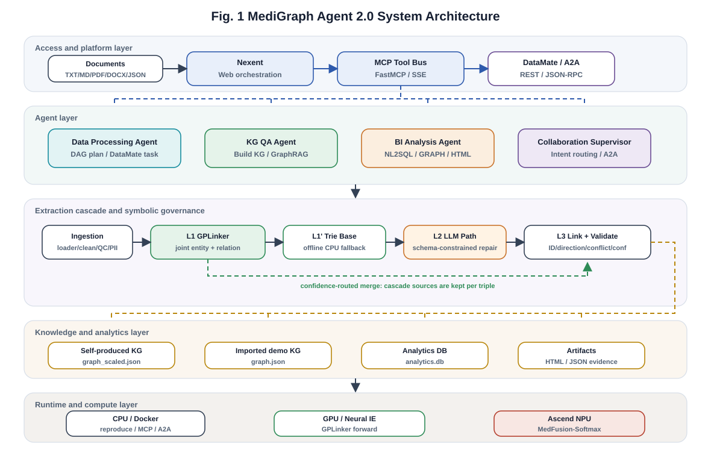

# MediGraph Agent 3.0：医疗数据—知识—洞察智能体

基于 Nexent、DataMate、MCP 与 A2A，实现「数据处理 → 医疗知识图谱 → 可溯源问答 →
图谱感知分析」完整闭环的开源智能体系统，面向 2026 ModelEngine 开源项目贡献赛。



> 医疗声明：本项目是比赛/研究原型，不提供诊断、处方或医学建议。

## 核心能力

1. **置信度路由抽取**：自训练 GPLinker 神经联合抽取为主力，毫秒级本地词典基线兜底，低置信难例再路由 L2 LLM；
2. **规范化与治理**：CM3KG 实体链接、置信度标定、schema/冲突校验和逐边溯源；
3. **智能体可靠性**：九算子 DAG、参数化重试、fallback、失败依赖跳过与产物自反思；
4. **硬指标可复现**：完整 CMeIE schema、128 题 NL2SQL 双库评测、315 个离线测试、一键复现清单与 SHA-256；
5. **一键容器部署**：Docker Compose 同时启动 MCP 与 A2A，并与 Nexent、DataMate 容器连通。

## 与赛题任务的对应

| 任务                   | 已实现能力                                                                                                                                               | 代码入口                                                                          |
| ---------------------- | -------------------------------------------------------------------------------------------------------------------------------------------------------- | --------------------------------------------------------------------------------- |
| 任务一：数据处理智能体 | 九算子动态目录；多格式接入、质检、PII、清洗、切块、抽取、链接、校验；DAG 重试/fallback/跳过/反思；0.8B LoRA 编排                                         | `medigraph/agents/`、`medigraph/operators/`、`finetune/`                    |
| 任务二：知识图谱问答   | L1/L2/L3 抽取级联；完整 CMeIE schema；规范 ID；边级 provenance；增量 delta；1–3 跳路径；可信等级与安全拒答                                              | `medigraph/extraction/`、`medigraph/graph/`、`medigraph/agents/qa_agent.py` |
| 任务三：图谱驱动分析   | KG 词表 Schema-Linking；确定性快路径 + LLM 执行纠错；只读/超时/行数保护；双库等价代理评测；PageRank/度中心性/Louvain 社区发现/最短路径关联分析；7 类图表 | `medigraph/analysis/`、`benchmarks/eval_nl2sql.py`                            |
| 加分：NPU              | Ascend C Softmax 与融合算子、torch_npu 对照、吞吐/延迟/能效记录                                                                                          | `NPU/`                                                                          |
| 平台集成               | DataMate REST、Nexent MCP、A2A Agent Card、四套 AgentConfig                                                                                              | `integration/`、`mcp_server/`                                                 |

每个评分项对应的证据文件、实测数字与复现命令，见
[docs/EVIDENCE_MAP.md](docs/EVIDENCE_MAP.md)。

## 快速开始

### 安装

```powershell
python -m venv .venv-neural            # 本文档后续命令都假定用这个环境（Python 3.10-3.12）
.\.venv-neural\Scripts\Activate.ps1
python -m pip install -r requirements.txt
copy .env.example .env
```

> 也可以直接装进系统 Python，但后文所有写成 `.\.venv-neural\Scripts\python.exe ...` 的
> 命令要相应替换。**混用两个解释器是最常见的"明明装过却报 `ModuleNotFoundError`"来源**——
> 新开的终端里裸 `python` 未必是你装依赖的那个。

本地离线 L1、测试、图谱和确定性 NL2SQL 不需要 API Key。只有 L2 难例、文字洞察、
向量检索和大模型规划需要填写 `.env`。

如需在 Nexent/MCP 网页端真实运行自训练神经 GPLinker L1（需要 torch），先执行：

```powershell
powershell -ExecutionPolicy Bypass -File scripts/setup_neural_env.ps1
```

之后 `scripts/start_mcp.ps1` 会自动优先使用 `.venv-neural`；缺少 torch 时系统仍会
自动退回词典/LLM 路径。

### Docker 一键部署

前提：Docker Desktop / Docker Engine 已启动；端口 `8011`、`8100` 空闲；如需 LLM
能力，先将 `.env.example` 复制为 `.env` 并填写自己的 Key。

```powershell
powershell -ExecutionPolicy Bypass -File scripts\docker_up.ps1
```

等价的跨平台命令：

```bash
docker compose up -d --build
```

启动后：

| 服务           | 宿主机地址                                       | Nexent 容器内地址                                           |
| -------------- | ------------------------------------------------ | ----------------------------------------------------------- |
| MediGraph MCP  | `http://127.0.0.1:8011/sse`                    | `http://host.docker.internal:8011/sse`                    |
| A2A Agent Card | `http://127.0.0.1:8100/.well-known/agent.json` | `http://host.docker.internal:8100/.well-known/agent.json` |

检查与停止：

```powershell
docker compose ps
docker compose logs --tail 100
powershell -ExecutionPolicy Bypass -File scripts\docker_down.ps1
```

说明：

- `data/` 与 `outputs/` 由 Compose 挂载进容器，不重复打入镜像；
- 默认镜像是轻量运行模式（不装 torch），仍支持词典快速路径、LLM fallback、
  GraphRAG、NL2SQL、MCP 和 A2A；需要容器内真实加载神经模型时改用
  `scripts\docker_up.ps1 -Neural`；
- 0.8B 微调编排模型可选，在宿主机运行 `scripts/start_finetuned_model.ps1`，
  容器通过 `host.docker.internal:18088` 访问；
- Compose 已将容器内 DataMate API 指向 `http://host.docker.internal:8080/api`，
  已有 DataMate/Nexent 容器时直接连通；
- 不要同时运行宿主机版与 Compose 版 MCP/A2A，否则会争用 `8011/8100` 端口。

### 一键离线复现

```powershell
.\.venv-neural\Scripts\python.exe -X utf8 scripts/reproduce_offline.py --quick
```

脚本依次重建本地抽取产物、拟合标定、执行全部离线测试、跑抽取与两套 NL2SQL 评测、
进行发布检查，并生成 `outputs/reproduction_manifest.json`（命令、耗时、环境、产物
SHA-256）。若需从上一级四套原始数据重新生成项目数据：

```powershell
python scripts/reproduce_offline.py --rebuild-dataset
```

分步复现命令与各指标的评测口径见
[docs/EVALUATION_PROTOCOL.md](docs/EVALUATION_PROTOCOL.md)。

## 抽取级联

| 层       | 实现                                                                                                               | 角色              |
| -------- | ------------------------------------------------------------------------------------------------------------------ | ----------------- |
| L1 神经  | 自训练 GPLinker（`chinese-macbert-large` 主力 + `chinese-roberta-wwm-ext` 集成），单次前向联合输出实体与三元组 | 主力抽取          |
| L1' 词典 | CMeIE/DIAKG/CM3KG 确定性构建的 Trie（41,530 带类型术语），CPU 亚毫秒                                               | 零依赖下界 / 对照 |
| L2 LLM   | schema 约束的补抽与修复                                                                                            | 低置信难例        |
| L3 治理  | 实体链接、规范 ID、类型/方向/阈值/冲突校验、逐边溯源                                                               | 符号治理          |

默认 `EXTRACTION_BACKEND=auto`：神经 L1 命中即用，难例/缺 GPU 时回退词典或 LLM：

```powershell
$env:EXTRACTION_BACKEND="fast"  # 完全离线
$env:EXTRACTION_BACKEND="llm"   # 纯 API 对照
$env:EXTRACTION_BACKEND="auto"  # 推荐
```

训练、评测细节与模型/数据边界见
[docs/MODEL_AND_DATA_CARDS.md](docs/MODEL_AND_DATA_CARDS.md)。

## Demo

### 演示视频

▶ [总决赛演示视频](https://gitlink.org.cn/maine/MediGraphAgent)
（约 76 MB。本仓库为精简发行版，视频托管在 GitLink 完整仓库，见文末「关于本仓库」）

一镜到底展示在 Nexent 网页端的真实运行：文档上传与 DataMate 五算子批处理 → 0.8B 编排模型
自动规划算子 DAG → 神经 GPLinker 建图 → 可溯源问答与安全拒答 → NL2SQL 与图谱可视化 →
多智能体协作 → 工程质量与关键指标。全程可见真实的工具调用轨迹。

GitLink 完整仓库的同一目录下还有分任务的原始录屏与截图，可与视频逐段对照：

| 文件                                     | 内容                                     |
| ---------------------------------------- | ---------------------------------------- |
| `任务一会话1.mp4`、`任务一会话2.mp4` | 数据处理智能体：算子编排与 DataMate 集成 |
| `任务二会话1.mp4`、`任务二会话2.mp4` | 知识图谱构建与可溯源问答                 |
| `任务三会话1.mp4`、`任务三会话2.mp4` | 图谱驱动分析与可视化                     |
| `命令行复现视频.mp4`                   | 命令行侧的离线复现全过程                 |
| `NPU运行录屏.mp4`、`NPU截图.png`     | 昇腾 910B 上 Ascend C 融合算子实测       |
| `微调日志截图.png`                     | 0.8B LoRA 编排模型训练与评测日志         |

### 命令行 Demo

```powershell
# 任务一：数据处理智能体
python demos/demo_task1_dataproc.py --input data/corpus --max-docs 1 `
  --goal "读取并清洗医疗文档，检查质量和隐私，抽取并规范化实体关系，校验三元组"

# 任务二：知识图谱问答
python demos/demo_task2_complete.py
python demos/demo_task2_qa.py --question "高血压使用的药物有哪些禁忌？" --hops 2

# 任务三：图谱驱动分析
python demos/demo_task3_complete.py

# 图算法：PageRank / 度中心性 / Louvain 社区发现 / 最短路径（任务三"关联分析"）
python -c "from medigraph.analysis.analysis_agent import AnalysisAgent; a=AnalysisAgent('outputs/analytics.db', graph_json='outputs/graph.json'); print(a.analyze('图谱中最核心的疾病有哪些？', verbose=True)['insight'])"

# 证据总览页：汇总核心指标 + 链接全部 BI/图谱图表 + 一次真实 DAG 执行血缘
python scripts/build_evidence_overview.py
```

评审可从 `outputs/evidence_overview.html` 一页起步，找到所有产物与对应证据文件。

## HTTP 服务层

除 CLI、MCP 与 A2A 之外，同一套算子与智能体也以 REST 服务暴露：

```powershell
python service/main.py          # 默认 127.0.0.1:8020
```

| 端点                                      | 说明                                                    |
| ----------------------------------------- | ------------------------------------------------------- |
| `GET /healthz` `/readyz` `/metrics` | 存活、逐依赖就绪明细、Prometheus 指标                   |
| `POST /api/v1/extract`                  | 置信度路由抽取，响应含命中层级与逐实体规范 ID           |
| `POST /api/v1/kg/build` `/kg/qa`      | 建图、图谱问答（含逐边证据）                            |
| `POST /api/v1/kg/qa/stream`             | **SSE 流式问答**，支持 `Last-Event-ID` 断线续传 |
| `POST /api/v1/analysis/nl2sql`          | 图谱感知 NL2SQL，AST 只读校验                           |
| `GET /docs`                             | OpenAPI 交互文档                                        |

工程特性：请求级 `X-Request-ID` 贯穿 JSON 结构化日志；DAG 执行器支持**拓扑分层并行**
与节点级超时；计划在执行前经**静态校验**（算子白名单、环检测、输入可满足性传播、
预算上限），不合法计划零执行成本被拒并触发重规划；SQL 走 **AST 白名单 + SQLite
authorizer 双层防御**。

存储层可选升级（`.env` 一键切换，SQLite 仍为零配置默认）：**PostgreSQL** 分析后端
（连接池 + 复合索引 + 服务端只读事务与语句超时，生成 SQL 经 sqlglot AST 转译双方言
执行）；**pgvector HNSW** 向量检索（`LocalVectorStore` 同接口）；**Redis 结果缓存**
（键含模型指纹，换模型自动失效；缓存不可用时自动降级为直连，命中率进 `/metrics`）。

实测吞吐 530.2 req/s、p99 49.9 ms、错误率 0%（关缓存基线；开缓存 577.5 req/s）；
SSE 首字节 17 ms（阻塞式为 10.3 s）；
20 万行下点查索引加速 85–355×、连接池 p50 6.6×；抽取缓存命中 1497 ms → 2.3 ms；
10 万×1024 维向量检索 recall@10=0.99 时 p50 5.7 ms（同轮 numpy 精确基线 16.4 ms）。
完整口径、复现命令与诚实边界见 [docs/PERFORMANCE.md](docs/PERFORMANCE.md)。

## Nexent / DataMate / A2A 集成

推荐直接使用上文的 Docker Compose。若不使用 Docker，也可在宿主机分别启动：

```powershell
powershell -ExecutionPolicy Bypass -File scripts/check_demo_services.ps1
powershell -ExecutionPolicy Bypass -File scripts/start_finetuned_model.ps1   # 可选
powershell -ExecutionPolicy Bypass -File scripts/start_mcp.ps1
powershell -ExecutionPolicy Bypass -File scripts/start_a2a.ps1
```

DataMate 五个可上传算子：

```powershell
python datamate_ops/build_zip.py
python integration/datamate/upload_operators.py
```

Nexent AgentConfig 模板位于 `integration/nexent_agents/`。MCP 直接暴露多格式读取、
质量检查、PII 脱敏、实体链接、建图、问答、分析与审计等 17 个工具。

## 实测结果

以下为已落盘实测的头部指标；完整表格、样本数与逐项证据见
[docs/EVIDENCE_MAP.md](docs/EVIDENCE_MAP.md)，口径定义见
[docs/EVALUATION_PROTOCOL.md](docs/EVALUATION_PROTOCOL.md)。

| 指标                                                                 |                                                     当前结果 | 证据                                        |
| -------------------------------------------------------------------- | -----------------------------------------------------------: | ------------------------------------------- |
| 离线测试                                                             | 315 passed（未放置外部原始数据集时为 314 passed, 1 skipped） | `tests/`                                  |
| CMeIE-V1 · 严格 SPO-F1（对照公开 GPLinker 0.598 / CasRel 0.606）    |                              **0.6146**（dev, strict） | `outputs/eval_neural_cmeie_v1_dev.json`   |
| L1 神经抽取 · CMeIE-V2 dev 实体 F1 / 端到端三元组 F1                |                     **0.7664 / 0.5343**（集成 0.5431） | `outputs/eval_neural_cmeie_dev.json`      |
| 实体链接 in-KB 准确率 / NIL 拒绝                                     |                                               0.9727 / 1.000 | `outputs/eval_entity_linking.json`        |
| 多跳 GraphRAG（120 题）检索/溯源/安全拒答核心<sup>*</sup>            |                                        1.000 / 1.000 / 1.000 | `outputs/eval_kg_qa.json`                 |
| 自产知识图谱规模（神经抽取，逐边溯源）                               |                          **43,566 实体 / 70,790 关系** | `outputs/kg_scale_report.json`            |
| NL2SQL：人工 16 题 / 128 题压力集 / 44 题非模板自然问句<sup>†</sup> |                                           100% / 100% / 100% | `outputs/eval_nl2sql*.json`               |
| 0.8B LoRA 编排 DAG 准确率 / 可执行率                                 |                                                0.973 / 1.000 | `finetune/outputs/eval_orchestrator.json` |
| NPU 融合算子吞吐 / 整卡能效（vs torch_npu）                          |                                              3.12× / 3.00× | `NPU/NPU_results/summary.json`            |

诚实边界：完整 53 关系、无 gold 实体的端到端三元组 F1，公开 SOTA 约 0.55–0.65；
本仓 0.534/0.543 为该困难口径下实测值，方案中的 0.80/0.85 属于未达成的挑战目标。

<sup>*</sup> 该 1.000/1.000/1.000 度量的是 QAAgent 与 `eval_kg_qa.py` 共用的检索/
溯源/安全打分核心（离线、无 API，问题由图谱自身遍历确定性生成），**不包含
LLM 表述层**——即不衡量 `QAAgent.answer()` 实际生成给用户的那段自然语言回答
是否忠实、相关、检索是否够用。这一层的独立评测见
[docs/EVIDENCE_MAP.md](docs/EVIDENCE_MAP.md) 的 Ragas 结果（`outputs/eval_ragas_kg_qa.json`），
用与作答同源的 LLM 作为裁判对真实生成的回答打分，与本行互为补充、不互相替代。
所有数字均可由仓内产物与一键复现脚本验证。

<sup>†</sup> **这三个 100% 的口径必须一起读，否则会被高估。** ① 128 题压力集由
`benchmarks/build_nl2sql_stress.py` **按模板生成**，且 128 题**全部由确定性模板路由
命中**（`llm_calls=0`）——问题与答案出自同一套模板，它度量的是路由覆盖面与可复现性，
**不是 LLM 的 Text-to-SQL 能力**；② 人工 16 题同样 16/16 走模板路由；③ 真正有区分度的
是 **44 题非模板自然问句集**（含子查询、跨表 JOIN、DISTINCT 计数、第 N 名、排除条件），
其中 **35 题由 LLM 生成、35/35 正确**。④ 三个集合在定稿前都被用来定位并修复路由器缺陷
（见 `docs/EVALUATION_PROTOCOL.md` 的"从 14 题到 44 题"），因此它们更接近**开发集**而非
留出测试集。作为补充，用一组**从未参与调优**的留出问句复测确定性路由，修掉两个新发现的
真实缺陷后为 **25/25**；两个缺陷已固化为回归测试（`tests/test_nl2sql_router.py`）。

## 目录结构

| 目录                             | 内容                                                                                       |
| -------------------------------- | ------------------------------------------------------------------------------------------ |
| `medigraph/extraction/`        | L1 快路径、标定、实体链接、级联合并                                                        |
| `medigraph/operators/`         | 九个统一算子                                                                               |
| `medigraph/agents/`            | 数据 DAG、KG 构建、GraphRAG                                                                |
| `medigraph/graph/`             | 本地/Neo4j、增量 delta、审计、路径                                                         |
| `medigraph/analysis/`          | Schema-Linking、中文数字归一化、NL2SQL、SQL AST 护栏、图算法（PageRank/社区/最短路径）、BI |
| `service/`                     | FastAPI 服务层：REST + SSE 流式 + 指标与结构化日志                                         |
| `data/prep/`                   | 数据、模型产物的确定性构建                                                                 |
| `data/models/`                 | L1、链接和标定产物                                                                         |
| `benchmarks/`                  | 抽取、标定、NL2SQL 与算子评测                                                              |
| `integration/`                 | DataMate、Nexent、A2A                                                                      |
| `mcp_server/`                  | Nexent MCP 工具                                                                            |
| `finetune/`                    | 0.8B LoRA 编排器                                                                           |
| `NPU/`                         | Ascend C 工程与实测                                                                        |
| `docs/`                        | 文档导航、评测协议、数据/模型卡、证据导航、架构图与技术报告                                |
| `scripts/`                     | 服务启动、训练、预测、一键复现与发布检查                                                   |
| `Dockerfile`、`compose.yaml` | MCP/A2A 一键容器构建、启动与健康检查                                                       |

## 文档导航

| 文档                                                        | 内容                                           |
| ----------------------------------------------------------- | ---------------------------------------------- |
| [docs/EVIDENCE_MAP.md](docs/EVIDENCE_MAP.md)                 | 评分项 → 证据文件 → 实测指标 → 复现命令     |
| [docs/EVALUATION_PROTOCOL.md](docs/EVALUATION_PROTOCOL.md)   | 各项评测口径与分步复现命令                     |
| [docs/MODEL_AND_DATA_CARDS.md](docs/MODEL_AND_DATA_CARDS.md) | 数据来源、隐私边界、模型卡与适用限制           |
| [docs/PERFORMANCE.md](docs/PERFORMANCE.md)                   | 服务吞吐 / SSE 感知延迟 / DAG 分层并行调度实测 |
| [docs/README.md](docs/README.md)                             | 文档索引与全部架构图                           |
| 技术报告 PDF / DOCX                                          | 见 [GitLink 完整仓库](https://gitlink.org.cn/maine/MediGraphAgent) 的 `docs/` |

## 提交前自检

先激活项目虚拟环境（见「安装」），否则 `python` 会落到系统解释器，缺 `sqlglot` /
`prometheus_client` 等依赖时会在收集阶段报 5 个 `ModuleNotFoundError`：

```powershell
.\.venv-neural\Scripts\Activate.ps1
python -m pytest -q            # 本发行版期望 306 passed, 9 skipped
python scripts/check_release.py
python scripts/check_claims.py --ci   # 期望 21/21 指标与证据 JSON 一致
```

不想改变当前会话时，等价的一次性写法：

```powershell
.\.venv-neural\Scripts\python.exe -X utf8 -m pytest -q
```

测试总数是 315 项，本发行版有 9 项因环境缺件自动 skip 而非失败：1 项需要 CMeIE-V2 原始
schema、1 项需要神经抽取权重（见「关于本仓库」）、7 项需要 PostgreSQL 容器在 5433 端口。
补齐这些依赖后 315 项全部执行。

其中 `test_cmeie_schema_has_all_53_rows` 需要 CMeIE-V2 原始 schema 位于
**仓库上一级**目录 `../CMeIE-V2/53_schemas.json`。该数据集有独立许可证、不随本仓库分发。放置方式见
`data/external_manifest.json`；数据已在别处时也可以只建一个目录链接：

```powershell
New-Item -ItemType Junction -Path ..\CMeIE-V2 -Target <你的CMeIE-V2目录>
```

`.env`、虚拟环境、缓存和临时日志由 `.gitignore` 排除；模型权重与演示视频不在本仓库，
见文末「关于本仓库」。外部数据逐文件来源与 SHA-256 清单见
`data/external_manifest.json`（原始 CMeIE-V1/V2、DIAKG、CM3KG 位于仓库上一级目录，
保留各自许可证边界）。

## 开源与安全

- 项目源代码：MIT License；
- 第三方数据/模型不随 MIT 重新授权，详见 `NOTICE`、`THIRD_PARTY_NOTICES.md`；
- 公开方法借鉴边界与原创设计点分别见 `INSPIRATION_REGISTER.md`、`ORIGINALITY.md`；
- 安全策略见 `SECURITY.md`；
- PII 算子是工程防线，不是正式匿名化合规证明。

## 关于本仓库

这是面向 GitHub 的**精简发行版**：全部源代码、测试、文档与评测证据文件（`outputs/eval_*.json`
等 18 份）都完整保留，clone 下来约 54 MB，不需要 Git LFS。

为控制体积，以下几类文件不在本仓库，它们都可以自行复现，或到
[GitLink 完整仓库](https://gitlink.org.cn/maine/MediGraphAgent)（含 LFS，约 4.3 GB）取得：

| 未收录内容                                                          | 复现方式                                            |
| ------------------------------------------------------------------- | --------------------------------------------------- |
| 自训练神经抽取权重 `data/models/neural_extractor*/`（约 3.4 GB）  | `scripts/train_neural_extractor.py`，命令见 `docs/EVALUATION_PROTOCOL.md` |
| 预训练编码器 `data/models/encoder/`（约 1.6 GB）                  | 从 HuggingFace 下载 `chinese-macbert-large` / `chinese-roberta-wwm-ext` |
| 0.8B LoRA 权重与训练 checkpoint（约 320 MB）                        | `python finetune/train_lora.py`（评测结果 `finetune/outputs/eval_orchestrator.json` 已保留） |
| 自产大图谱 `outputs/graph_scaled.json`（84 MB）                   | `python scripts/build_scaled_kg.py`（规模报告 `outputs/kg_scale_report.json` 已保留） |
| CMeIE test 预测 `outputs/CMeIE_test_pred.jsonl`                   | `python scripts/predict_cmeie_test.py`              |
| 演示视频与录屏（约 435 MB）、技术报告 PDF/DOCX                       | GitLink 完整仓库                                    |
| NPU profiler 二进制 dump                                            | GitLink 完整仓库（`NPU/NPU_results/` 下的 JSON 汇总与日志已保留） |

演示用的 `outputs/graph.json`（CM3KG 导入图谱）与 `outputs/analytics.db` 已随包提供，
因此「快速开始」里的问答与分析示例开箱即可运行。
