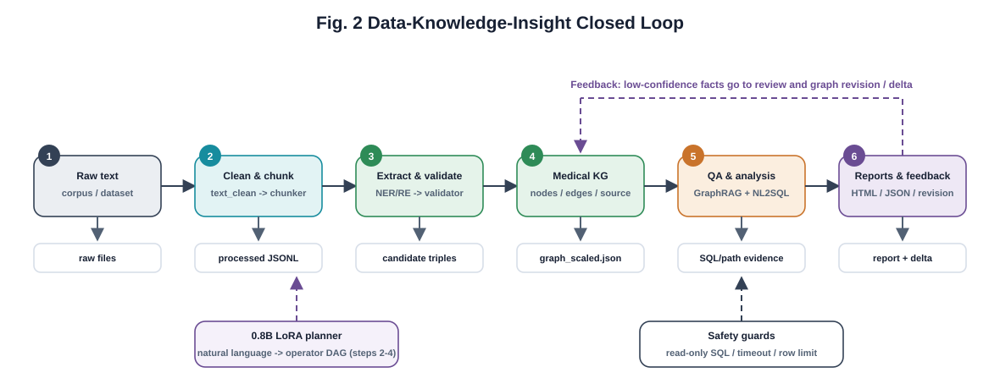
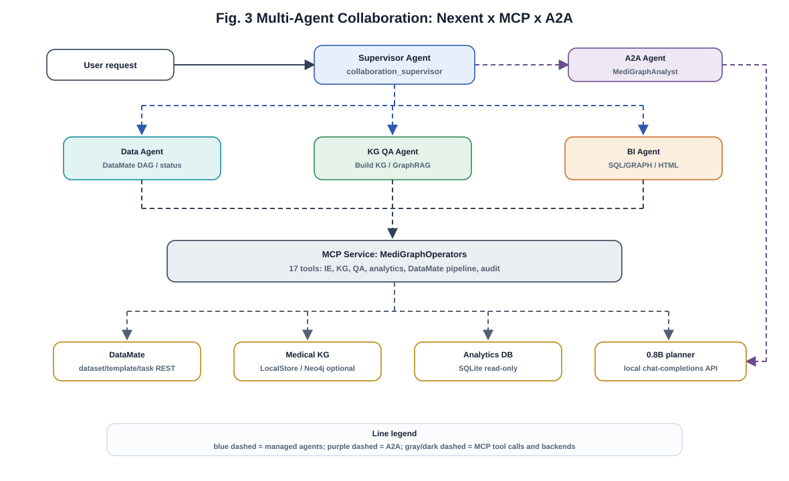
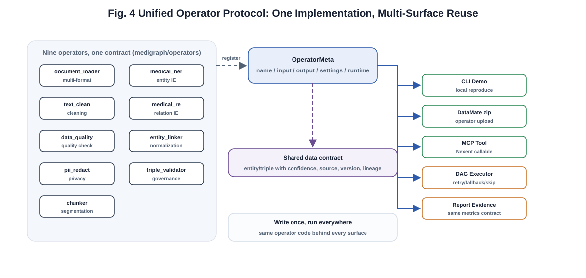
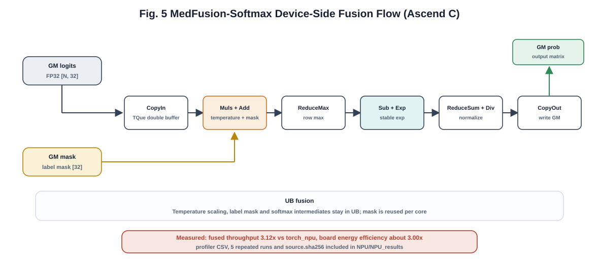
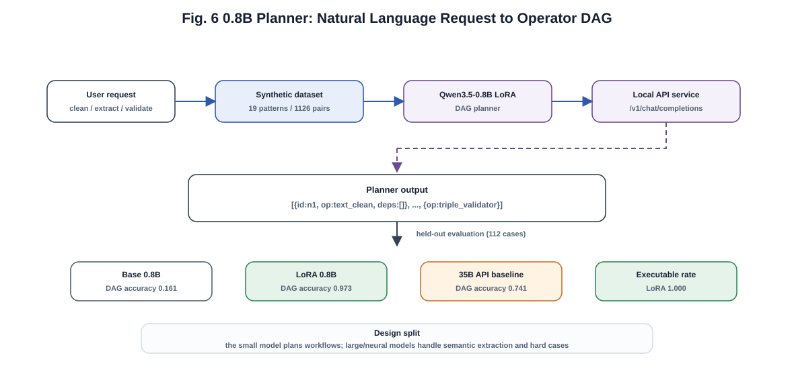

# 文档导航

本目录保存提交评审与复现核验所需的集中说明材料。运行时代码不依赖本目录中的 Markdown 文件；这些文档用于说明架构、指标口径、数据与模型边界，以及每个评分项对应的证据文件。

## 文档清单

| 文件 | 内容 |
| --- | --- |
| `EVIDENCE_MAP.md` | 评分项、证据文件、实测指标与复现命令的集中导航。 |
| `EVALUATION_PROTOCOL.md` | 抽取、实体链接、GraphRAG、NL2SQL、置信度标定、CMeIE 对照实验等评测口径。 |
| `MODEL_AND_DATA_CARDS.md` | 数据来源、隐私边界、模型产物、训练/推理限制和适用范围。 |
| `PERFORMANCE.md` | 服务层实测：HTTP 吞吐、SSE 感知延迟、DAG 并行调度、PG 索引/连接池、ANN 检索与缓存。 |
| 技术报告 PDF / DOCX | 不在这个 GitHub 精简发行版中，见 [GitLink 完整仓库](https://gitlink.org.cn/maine/MediGraphAgent) 的 `docs/`。 |
| `figures/` | 技术报告和说明文档使用的 SVG 架构图。 |

## 架构图

### 图 1：系统总体架构


### 图 2：数据—知识—洞察闭环



### 图 3：多智能体协作



### 图 4：统一算子协议



### 图 5：NPU 融合算子数据流



### 图 6：0.8B 小模型编排



## 复现入口

常用核验命令：

```powershell
python -m pytest -q
python scripts/check_release.py
python scripts/check_claims.py --ci
python scripts/reproduce_offline.py --quick
python scripts/build_evidence_overview.py   # 生成 outputs/evidence_overview.html 一页导航
```

每个头部指标的样本数、评测脚本、输出 JSON 与边界说明以 `EVIDENCE_MAP.md` 和 `EVALUATION_PROTOCOL.md` 为准。
公开方法借鉴边界与原创设计点见仓库根目录 `INSPIRATION_REGISTER.md`、`ORIGINALITY.md`。
